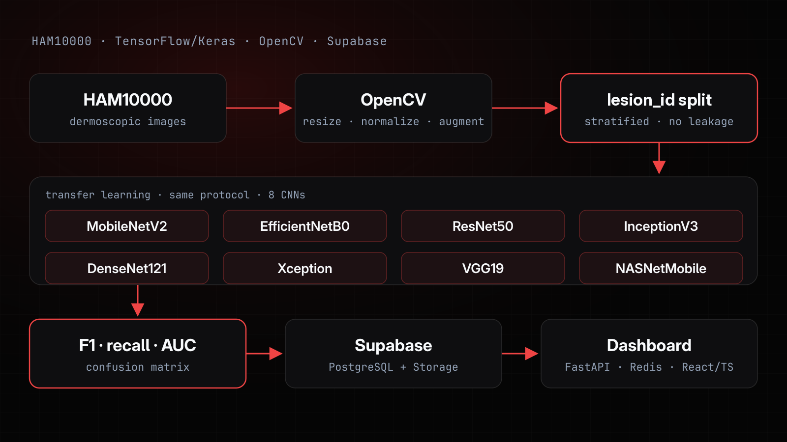

# Skin Analyser — Triagem de Lesões Cutâneas com CNNs

Pipeline de classificação de imagens dermatoscópicas do dataset público HAM10000: pré-processamento, separação de dados sem vazamento, comparação de 8 arquiteturas de rede neural convolucional em transfer learning e avaliação por métrica, com execuções registradas no Supabase e expostas em dashboard.

> **Estado atual.** O projeto Supabase usado no TCC foi apagado, e com ele as tabelas do dataset e as métricas das execuções. O código do pipeline e do dashboard continua aqui, mas precisa de um projeto Supabase próprio (veja [Como rodar](#como-rodar)).

> **Aviso.** Projeto de triagem com fins de estudo. Não é dispositivo médico, não faz diagnóstico e não substitui a avaliação de um profissional de saúde.



## Dados

- **HAM10000** — Tschandl, Rosendahl e Kittler, *Scientific Data* 5, 180161 (2018). As imagens **não** são redistribuídas neste repositório: baixe-as da fonte oficial e respeite a licença do dataset.
- **Separação por lesão.** O HAM10000 tem 10.015 imagens de 7.470 lesões: a mesma lesão aparece em várias fotos, e o dataset não publica identificador de paciente. O script de retreino separa treino, validação e teste por `lesion_id`, com estratificação por classe (`StratifiedGroupKFold`), então fotos da mesma lesão nunca ficam em partições diferentes. O `system.py` original separava imagem a imagem, estratificado só por diagnóstico, o que deixa a mesma lesão no treino e no teste e infla a métrica.

## Pipeline

- **Pré-processamento (OpenCV):** redimensionamento, normalização e augmentation, com a mesma entrada para todas as arquiteturas.
- **Modelos:** 8 backbones em transfer learning, com pesos do ImageNet e congelados — MobileNetV2, EfficientNetB0, ResNet50, InceptionV3, DenseNet121, Xception, VGG19 e NASNetMobile —, sob protocolo idêntico (VGG16 também está disponível na configuração padrão). O construtor monta o ramo de imagem a partir da lista em `MODEL_CONFIG`: trocar de arquitetura é trocar configuração, sem duplicar código.
- **Controle de overfitting:** augmentation, dropout, regularização L2, early stopping e redução de learning rate em platô, com o gap entre treino e validação acompanhado a cada época.
- **Avaliação:** F1-score, recall, AUC e matriz de confusão por classe, priorizando recall na classe de maior risco clínico.

## Resultados

As métricas do treino original se perderam junto com o projeto Supabase. O script [`kaggle/treino_ham10000.py`](kaggle/treino_ham10000.py) refaz o treino com separação por lesão, e os números medidos entram aqui, com os arquivos em `results/`, quando o retreino rodar.

## Rastreamento e dashboard (`metrics_dashboard/`)

Cada execução grava as métricas por lote e por imagem no Supabase (tabelas `batch_metrics` e `image_metrics`), no lugar da inspeção manual em notebook. Para usar o rastreamento, crie um projeto Supabase e aplique a migration `supabase/migrations/001_dashboard_views.sql`.

- **Banco:** `supabase/migrations/001_dashboard_views.sql` cria views materializadas no PostgreSQL com os KPIs diários (acurácia, confiança média, sensibilidade e especificidade), o desempenho por classe e o monitoramento de drift. Com a extensão `pg_cron`, as views de KPIs e de desempenho são atualizadas a cada 5 minutos.
- **Backend (`backend/main.py`):** FastAPI com schemas Pydantic, CORS e cache assíncrono em Redis nas rotas de leitura, para não recalcular a cada requisição. Rotas principais: `/api/v1/kpis`, `/api/v1/diagnosis-performance`, `/api/v1/confusion-matrix`, `/api/v1/time-series/{metric}`, `/api/v1/drift`, `/api/v1/cases-for-review` e `/health`.
- **Frontend (`frontend/src/App.tsx`):** painel em React/TypeScript que consome o backend.
- **`last.py`:** versão do painel em Streamlit + Plotly, lendo direto do Supabase.
- **`data.py`:** gerador de dados sintéticos para testar o painel sem depender de uma execução real.

## Engenharia

Interface de terminal com Rich, log com níveis e cores via colorlog, type hints e dataclasses separando carga de dados, construção do modelo, treino e avaliação.

## Como rodar

**Retreino (recomendado).** O `kaggle/treino_ham10000.py` é autocontido: reimplementa o protocolo do `system.py` (backbones congelados do ImageNet, augmentation, dropout, L2, early stopping, redução do learning rate em platô e pesos por classe) e grava em `results/` o `metrics.csv` (acurácia, F1 macro, recall e AUC de melanoma, AUC macro), o relatório e a matriz de confusão por arquitetura, e a partição de cada imagem.

1. No Kaggle, crie um notebook, adicione o dataset `kmader/skin-cancer-mnist-ham10000` e ligue a GPU e a internet.
2. Rode numa célula:

   ```bash
   !git clone https://github.com/ClaudineiAlves/skin-analyser.git
   !python skin-analyser/kaggle/treino_ham10000.py   # padrão: efficientnetb0 densenet121 resnet50
   ```

3. Baixe a pasta `results/` pela aba Output do notebook.

Fora do Kaggle, instale `tensorflow`, `scikit-learn` e `pandas` e use `--data-dir` apontando para a pasta com o `HAM10000_metadata.csv` e as imagens. `--archs` escolhe entre as 8 arquiteturas, e `--limit 200 --epochs 1` faz um teste rápido.

**Pipeline original.** O `system.py` foi exportado de um notebook do Google Colab e ainda não roda fora dele. Ele lê três CSVs em `/content/data/` (`ham10000_images.csv`, `ham10000_diagnoses.csv` e `ham10000_lesions.csv`), que eram exportações das tabelas do Supabase com os metadados do HAM10000 no formato do ISIC Archive (`isic_id`, `diagnosis_1` a `diagnosis_3`, `benign_malignant`, `melanocytic`). Essas tabelas não existem mais, e as URLs das imagens em `ham10000_images.csv` apontavam para o Storage do mesmo projeto: é preciso gerar os três CSVs a partir dos metadados do ISIC Archive, com URLs válidas, antes de rodar. As credenciais do Supabase vêm das variáveis de ambiente `SUPABASE_URL` e `SUPABASE_KEY` (ou da configuração `supabase`, com `URL` e `Key`) e nunca devem ser versionadas: `.env`, `*.env` e `config.json` estão no `.gitignore`.

```bash
pip install -r requirements.txt
export SUPABASE_URL=... SUPABASE_KEY=...
python system.py
```

**Backend do dashboard.** Aplique a migration no projeto Supabase e rode:

```bash
cd metrics_dashboard/backend
pip install -r requirements.txt
export SUPABASE_URL=... SUPABASE_KEY=...    # REDIS_URL padrão: redis://localhost:6379
uvicorn main:app --reload
```

| Variável | Padrão | Uso |
|---|---|---|
| `SUPABASE_URL`, `SUPABASE_KEY` | — | Projeto Supabase com as tabelas e views |
| `REDIS_URL` | `redis://localhost:6379` | Cache das rotas de leitura |
| `CACHE_TTL` | `300` | Validade do cache, em segundos |
| `ALERT_ACCURACY` | `0.85` | Limiar de alerta de acurácia |
| `ALERT_MELANOMA_SENS` | `0.95` | Limiar de alerta de sensibilidade para melanoma |
| `DRIFT_PSI` | `0.25` | Limiar de PSI para alerta de drift |

## Stack

Python · TensorFlow/Keras · Scikit-learn · OpenCV · Pandas · NumPy · Supabase (PostgreSQL + Storage) · FastAPI · Redis · React/TypeScript · Rich · colorlog

## Licença

Código sob a [licença MIT](LICENSE). As imagens e os metadados do HAM10000 seguem a licença do dataset (CC BY-NC) e não fazem parte deste repositório.

## Autoria

Desenvolvido por **Claudinei Alves Reis** — [LinkedIn](https://www.linkedin.com/in/claudinei-alves-reis/) · [Portfólio](https://claudineiportfolio.vercel.app)
